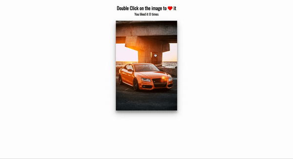

# 50 Projects in 50 Days - Double Click Heart

This is a code along project in the [50 Projects In 50 Days - HTML, CSS & JavaScript Udemy Course](https://www.udemy.com/course/50-projects-50-days/). Sharpen your skills by building 50 quick, unique & fun mini projects.

## Table of contents 😌

- [Overview](#overview)
  - [The project](#the-project)
  - [Screenshot](#screenshot)
  - [Links](#links)
- [My process](#my-process)
  - [Built with](#built-with)
  - [What I learned](#what-i-learned)
  - [Continued development](#continued-development)
  - [Code snippets](#im-really-proud-of-these-code-snippets%EF%B8%8F)
  - [Useful resources](#useful-resources)
- [Author](#author)
- [Acknowledgments](#acknowledgments)

## Overview👋🏾

Welcome to the 29<sup>th</sup> mini-project of the course!

### The project😥

In this project users will be able to:

- Build a responsive site that displays double click heart animation that appears with a click.

### Screenshot🌇



### Links👩🏾‍💻

- Live Site URL: (https://polite-gnome-58c6da.netlify.app/)

## My process💭

This is a simple project that I started by marking out initial structure, classes, and id's in HTML. Next I finalized the UI by styling the CSS. I styled the background image as well as added animation to the heart icon. I then added functionality by way of JavaScript to create a double click addEventListener type, create the heart element, and add a counter to count how many 'likes' the image receives.

### Built with👷🏾‍♀️

- Semantic HTML5 markup
- CSS custom properties
- Flexbox
- JavaScript

### What I learned👩🏾‍🏫

I learned the logic behind creating a double click addEventListener type.

### Continued development🔮

I also plan on continuing to practice using event listeners to make my pages more functional.

### I'm really proud of these code snippets✂️

```css
.loveMe .fa-heart {
  position: absolute;
  animation: grow 0.6s linear;
  transform: translate(-50%, -50%) scale(0);
}

@keyframes grow {
  to {
    transform: translate(-50%, -50%) scale(10);
    opacity: 0;
  }
}
```

```js
// Creating a double click addEventListener type
loveMe.addEventListener('click', (e) => {
    if (clickTime === 0) {
        clickTime = new Date().getTime()
    } else {
        // if new date time is less than 800ms
        if ((new Date().getTime() - clickTime) < 800) {
            // console.log(123);
            createHeart(e)
            clickTime = 0
        } else {
            clickTime = new Date().getTime()
        }
    }
})

const createHeart = (e) => {
    const heart = document.createElement('i')
    heart.classList.add('fas')
    heart.classList.add('fa-heart')

    const x = e.clientX
    const y = e.clientY

    // console.log('x:',x, 'y:',y);

    const leftOffset = e.target.offsetLeft
    const topOffset = e.target.offsetTop

    // console.log('leftOffset:',leftOffset, 'topOffset:',topOffset);

    // x & y values *inside* the image
    const xInside = x - leftOffset
    const yInside = y - topOffset

    // console.log('xInside:', xInside, 'yInside:',yInside);

    heart.style.top = `${yInside}px`
    heart.style.left = `${xInside}px`

    loveMe.appendChild(heart)

    times.innerText = ++timesClicked

    // Removes extra heart elements from the DOM after 1 sec
    setTimeout(() => heart.remove(), 1000);
}
```

### Useful resources📖

- [Resource](https://developer.mozilla.org/en-US/docs/Web/API/EventTarget/addEventListener) - This is an amazing article which details all of the addEventListener types. I'd recommend it to anyone still learning this concept.

## Author🔎

- Website - [Portfolio Site](https://maiannethornton.netlify.app/)
- Frontend Mentor - [@MaianneThornton](https://www.frontendmentor.io/profile/MaianneThornton)
- GitHub - [@MaianneThornton](GitHub.com/MaianneThornton)
- Twitter - [@MaianneThornton](https://twitter.com/MaianneThornton)
- LinkedIn - [@MaianneThornton](https://www.linkedin.com/in/maiannethornton/)

## Acknowledgments🙏🏾

Special Thanks go to [Brad Traversy](http://www.traversymedia.com/) and [Florin Pop](http://www.florin-pop.com/) creating the course and making reviewing concepts fun 😊.
